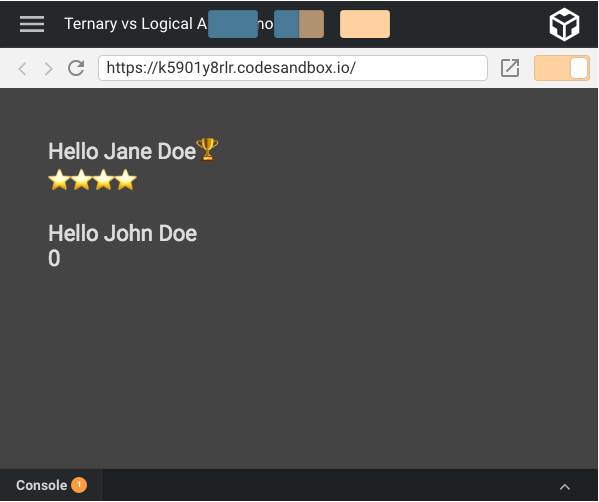
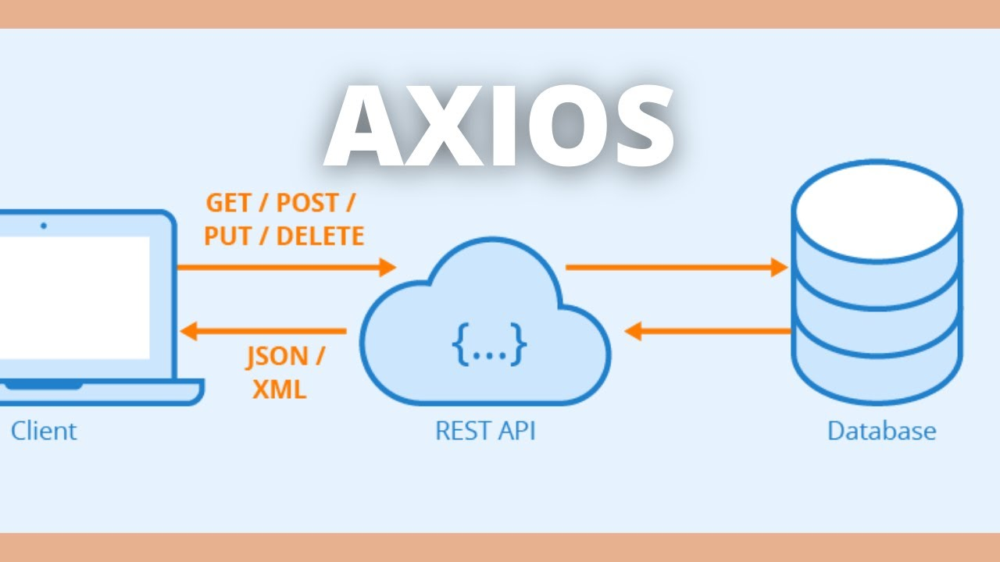

# Course Checkpoint 17

## ¿Qué significa CRUD?


Las operaciones CRUD son uno de los conceptos más fundamentales en el desarrollo web. Ya sea que esté creando una aplicación web simple o un sistema empresarial complejo, comprender las operaciones CRUD es esencial para trabajar con datos. En este artículo, veremos qué significa CRUD y cómo se utiliza para gestionar datos en una base de datos. También veremos algunos ejemplos prácticos de operaciones CRUD en acción, así como consejos y mejores prácticas para implementar CRUD en sus propios proyectos. Ya sea que sea nuevo en el desarrollo web o un profesional experimentado, este artículo lo ayudará a obtener una comprensión más profunda del papel de las operaciones CRUD en la creación de aplicaciones web confiables y escalables.

### ¿Qué es CRUD?

CRUD Acrónimo de Crear, Leer, Actualizar y Eliminar, estas son las cuatro operaciones básicas que se realizan al administrar y manipular datos como parte del desarrollo de software. Estas operaciones forman la base de la mayoría de las aplicaciones que interactúan con bases de datos o sistemas de almacenamiento. Por ejemplo, considere una aplicación de comercio electrónico en la que los usuarios pueden agregar productos a su tienda en línea. La operación Nuevo permite a los usuarios agregar nuevos productos, mientras que la operación Leer recupera información del producto para mostrarla.

Cuando el propietario de la tienda actualiza la información del producto o el precio, entra en juego la operación de Actualización. Finalmente, cuando un producto ya no está disponible o es necesario eliminarlo, se utiliza la operación Eliminar. Al implementar estas operaciones CRUD, los desarrolladores de software pueden proporcionar una experiencia de usuario intuitiva y fluida que les permita interactuar sin problemas con los datos subyacentes. La implementación de operaciones CRUD a menudo depende de la pila de tecnología que se utiliza, como una base de datos SQL, una base de datos NoSQL o una API RESTful.

### Beneficios de CRUD

Los beneficios de utilizar operaciones CRUD en el desarrollo de software son numerosos y mejoran enormemente la eficiencia, la mantenibilidad y la experiencia del usuario de las aplicaciones. Algunos de los beneficios clave incluyen los siguientes:

- Estandarización: las operaciones CRUD proporcionan un marco común para interactuar con sistemas de almacenamiento, lo que facilita a los desarrolladores comprender y trabajar con diferentes aplicaciones y plataformas.
- Proceso de desarrollo simplificado: al seguir el modelo CRUD, los desarrolladores pueden simplificar el proceso de creación de aplicaciones porque tienen un conjunto claro de operaciones para manipular datos. Esto promueve prácticas de desarrollo consistentes y eficientes.
- Mantenibilidad mejorada: las aplicaciones basadas en CRUD son generalmente más fáciles de mantener porque siguen un enfoque estandarizado para la gestión de datos. Esto facilita a los desarrolladores solucionar problemas y actualizar la aplicación según sea necesario.
- Experiencia de usuario mejorada: la implementación de operaciones CRUD permite a los usuarios realizar sin problemas tareas importantes como crear, leer, actualizar y eliminar datos en la aplicación. Esto da como resultado una experiencia de usuario intuitiva y satisfactoria.
- Modularidad y flexibilidad: la separación de preocupaciones en las aplicaciones CRUD promueve la modularidad y la flexibilidad. Esto significa que los desarrolladores pueden cambiar o ampliar fácilmente partes individuales de la aplicación sin afectar a todo el sistema.
- Escalabilidad: al seguir el modelo CRUD, las aplicaciones escalan más fácilmente para satisfacer los crecientes requisitos de datos o de los usuarios. Un enfoque estandarizado para la gestión de datos permite a los desarrolladores optimizar el rendimiento y garantizar que la aplicación pueda manejar mayores cargas de trabajo.
- Compatible con una variedad de tecnologías: las operaciones CRUD son aplicables a una variedad de tecnologías, incluidas bases de datos relacionales, bases de datos NoSQL, API RESTful y GraphQL. Esta versatilidad facilita a los desarrolladores la implementación e integración de sistemas basados en CRUD en varias pilas de tecnología.

### ¿Qué es la operación CREATE y cómo funciona?

La operación CREATE, la primera de cuatro operaciones CRUD, agrega nuevos registros de datos u objetos a un sistema de almacenamiento de datos, como una base de datos o API. En el desarrollo de software, la operación CREATE permite a los usuarios crear nuevos registros o recursos en una aplicación. Por ejemplo, cuando un usuario se registra en una plataforma de redes sociales, la operación CREATE almacena la información del usuario, como su nombre de usuario, correo electrónico y contraseña, en la base de datos. Este proceso normalmente implica recibir información del usuario, validar los datos y crear una nueva instancia del modelo de datos (como un objeto de usuario).

Después de preparar una nueva instancia, la operación CREATE la inserta en el sistema de almacenamiento, asignándole un identificador único para su posterior recuperación y modificación. La implementación de la operación CREATE depende de la pila de tecnología que se utiliza, como emitir un comando SQL "INSERT" en una base de datos relacional o una solicitud HTTP "POST" en una API RESTful. Al proporcionar un mecanismo para almacenar nuevos datos, la operación CREATE permite a los desarrolladores crear aplicaciones dinámicas e interactivas que evolucionan continuamente en función de las aportaciones del usuario.

### ¿Qué es una operación READ y cómo funciona?

La operación READ, el segundo elemento del paradigma CRUD, es necesaria para recuperar y mostrar datos de un sistema de almacenamiento como una base de datos o API. En el desarrollo de software, la operación LEER permite a los usuarios acceder y ver información almacenada en una aplicación. Por ejemplo, al navegar por una tienda en línea, la operación LEER recupera datos del producto como el título, el precio y la descripción de la base de datos y los muestra para que el usuario los vea e interactúe con ellos. Este proceso normalmente implica consultar el sistema de almacenamiento de datos utilizando ciertos parámetros o filtros para encontrar los datos deseados.

Una vez que se reciben los datos, a menudo se transforman o se formatean para presentarlos fácilmente en la interfaz de la aplicación. La implementación de la operación READ depende de la pila de tecnología que se utiliza, como ejecutar un comando SQL "SELECT" en una base de datos relacional o una solicitud HTTP "GET" en una API RESTful. La operación READ permite a los desarrolladores crear aplicaciones ricas, informativas y atractivas que satisfacen una variedad de necesidades y preferencias de los usuarios al proporcionar un mecanismo para acceder y mostrar datos almacenados.

### ¿Qué es la operación UPDATE y cómo funciona?

La operación UPDATE, el tercer componente del marco CRUD, es responsable de modificar los datos existentes en un sistema de almacenamiento como una base de datos o API. En el desarrollo de software, la operación UPDATE permite a los usuarios cambiar información previamente almacenada en una aplicación. Por ejemplo, cuando un usuario actualiza su foto de perfil en una plataforma de redes sociales, la operación UPDATE reemplaza la imagen anterior por una nueva en la base de datos. Este proceso normalmente implica identificar el registro o recurso específico que se va a cambiar, validar los nuevos datos y aplicar los cambios al sistema de almacenamiento.

La operación UPDATE garantiza la integridad y coherencia de los datos manteniendo un identificador de registro único cuando cambia su contenido. La implementación de la operación UPDATE depende de la pila de tecnología que se utiliza, como emitir un comando SQL "UPDATE" en una base de datos relacional o una solicitud HTTP "PUT" o "PATCH" en una API RESTful. Al proporcionar un mecanismo para cambiar los datos almacenados, la operación ACTUALIZAR permite a los desarrolladores crear aplicaciones adaptables y responsivas que pueden evolucionar en función de la interacción del usuario y los requisitos cambiantes.

### ¿Qué es la operación DELETE y cómo funciona?

La operación DELETE, el aspecto final del marco CRUD, es responsable de eliminar datos de un sistema de almacenamiento como una base de datos o API. En el desarrollo de software, la operación DELETE permite a los usuarios eliminar permanentemente entradas o recursos específicos en una aplicación. Por ejemplo, cuando un usuario elimina una publicación de la plataforma de blogs, la operación DELETE elimina los datos asociados de la base de datos. Este proceso normalmente implica encontrar el registro o recurso que se va a eliminar utilizando su identificador único y emitir un comando para eliminarlo del sistema de almacenamiento.

Es fundamental que el proceso de eliminación mantenga la integridad y coherencia de los datos mediante el manejo adecuado de los datos asociados, como restricciones de clave externa en una base de datos relacional o recursos dependientes en una API RESTful. La implementación de la operación DELETE depende de la pila de tecnología que se utiliza, por ejemplo, ejecutar un comando SQL "DELETE" en una base de datos relacional o una solicitud HTTP "DELETE" a una API RESTful. Al proporcionar un mecanismo para eliminar datos almacenados, la operación DELETE permite a los desarrolladores crear aplicaciones flexibles y manejables que pueden adaptarse a las necesidades del usuario, cumplir con las políticas de retención de datos y optimizar los recursos de almacenamiento.

### Conclusión

En conclusión, el marco CRUD, que incluye las operaciones Create, Read, Update y Delete, sirve como piedra angular para una gestión y manipulación eficaz de datos en el desarrollo de software. Siguiendo el modelo CRUD, los desarrolladores pueden crear aplicaciones que sean intuitivas, escalables y mantenibles, proporcionando una experiencia de usuario perfecta. Estas operaciones sirven a diferentes pilas de tecnología, lo que garantiza la compatibilidad y versatilidad con los métodos de desarrollo modernos. A medida que el mundo depende cada vez más de aplicaciones basadas en datos, comprender y dominar las operaciones CRUD se ha vuelto aún más importante para los desarrolladores de software. La adopción del paradigma CRUD simplifica el proceso de desarrollo y abre el camino a la innovación. Los desarrolladores pueden centrarse en crear funciones y experiencias únicas para deleitar a los usuarios y mantenerse a la vanguardia en el panorama digital en constante evolución.

---
---
## ¿Qué es un operador ternario?


Hay varias formas en que su componente React puede decidir qué renderizar. Puede utilizar la sentencia if tradicional o la sentencia switch. En este artículo, exploraremos algunas alternativas. Pero ten en cuenta que algunos vienen con sus propias gotchas, si no tienes cuidado.

### Ternario frente a if/else

Digamos que tenemos un componente al que se le pasa un nombre prop. Si la cadena no está vacía, mostramos un saludo. De lo contrario, le decimos al usuario que necesita iniciar sesión.

Aquí hay un componente de función sin estado (SFC) que hace precisamente eso.

```JavaScript
const MyComponent = ({ name }) => {
  if (name) {
    return <div className="hello"> Hello {name} </div>;
  }
  return <div className="hello"> Please sign in </div>;
};
```

Bastante sencillo. Pero podemos hacerlo mejor. Aquí está el mismo componente escrito usando un operador ternario condicional.

```JavaScript
const MyComponent = ({ name }) => (
  <div className="hello"> {name ? `Hello ${name}` : "Please sign in"} </div>
);
```

Observe cuán conciso es este código en comparación con el ejemplo anterior.

Algunas cosas a tener en cuenta. Debido a que estamos utilizando la forma de declaración única de la función de flecha, la declaración de retorno está implícita. Además, el uso de un ternario nos permitió DRY el marcado < div className = «hello» > duplicado.?

### Ternario vs Lógico Y

Como puede ver, los ternarios son maravillosos para las condiciones if/else. Pero ¿qué pasa con las condiciones simples si?

Veamos otro ejemplo. Si isPro (un booleano) es cierto, debemos mostrar un emoji de trofeo. También debemos renderizar el número de estrellas (si no cero). Podríamos hacerlo así.

```JavaScript
const MyComponent = ({ name, isPro, stars }) => (
  <div className="hello">
    {" "}
    <div>
      {" "}
      Hello {name} {isPro ? "?" : null}{" "}
    </div>{" "}
    {stars ? <div> Stars:{"⭐️".repeat(stars)} </div> : null}{" "}
  </div>
);
```

Pero observe que las condiciones «else» devuelven null. Esto es porque un ternario espera otra condición.

Para condiciones if simples, podríamos usar algo un poco más apropiado: el operador AND lógico. Aquí está el mismo código escrito usando un AND lógico.

```JavaScript
const MyComponent = ({ name, isPro, stars }) => (
  <div className="hello">
    {" "}
    <div>
      {" "}
      Hello {name} {isPro && "?"}{" "}
    </div>{" "}
    {stars && <div> Stars:{"⭐️".repeat(stars)} </div>}{" "}
  </div>
);
```

No es muy diferente, pero observe cómo eliminamos el: null (es decir, condición else) al final de cada ternario. Todo debe renderizarse como lo hacía antes.



Hola. ¿Qué pasa con John? Hay un 0 cuando nada debe ser renderizado. Ese es el gotcha al que me refería anteriormente. He aquí por qué.

Según MDN, un AND lógico (es decir, & &):

expr1 y expr2

Devuelve expr1 si se puede convertir en false; de lo contrario, devuelve expr2. Así, cuando se utiliza con valores booleanos, & & devuelve true si ambos operandos son true; de lo contrario, devuelve false.

Vale, antes de que empieces a arrancarte el pelo, déjame que te lo suelte.

En nuestro caso, expr1 es la variable estrellas, que tiene un valor de 0. Debido a que cero es falsey, 0 se devuelve y se procesa. Eso no estuvo tan mal.

Escribiría esto simplemente.

Si expr1 es falsey, devuelve expr1, de lo contrario devuelve expr2.

Entonces, cuando usamos un AND lógico con valores no booleanos, debemos hacer que el valor falsey devuelva algo que React no renderizará. Digamos, como un valor de falso.

Hay algunas maneras en que podemos lograr esto. Probemos esto en su lugar.

```JavaScript
{
  !!stars && <div> {"⭐️".repeat(stars)} </div>;
}
```

Observe el operador de doble explosión (es decir,!!) delante de las estrellas. (Bueno, en realidad no hay un «operador de doble explosión». Solo estamos usando el operador bang dos veces.)

El primer operador bang coaccionará el valor de las estrellas en un booleano y luego realizará una operación NOT. Si estrellas es 0, entonces! estrellas producirán verdadero.

Luego realizamos una segunda operación NOT, por lo que si estrellas es 0,!! estrellas produciría falso. Exactamente lo que queremos.

Si no eres fan de!!, también puedes forzar un booleano como este (que me parece un poco prolijo).

```JavaScript
{Boolean(stars) && (
```

O simplemente dar un comparador que resulta en un valor booleano (que algunos podrían decir que es aún más semántico).

```JavaScript
{stars > 0 && (
```

Los valores de cadena vacíos sufren el mismo problema que los números. Pero debido a que una cadena vacía renderizada es invisible, no es un problema con el que probablemente tendrá que lidiar o incluso notará. Sin embargo, si eres un perfeccionista y no quieres una cadena vacía en tu DOM, debes tomar precauciones similares a las que tomamos para los números anteriores.

### Otra solución

Una posible solución, y una que escala a otras variables en el futuro, sería crear una variable shouldRenderStars separada. Entonces estás tratando con valores booleanos en tu AND lógico.

```JavaScript
const shouldRenderStars = stars > 0;
return <div> {shouldRenderStars && <div> {"⭐️".repeat(stars)} </div>} </div>;
```

Luego, si en el futuro, la regla de negocios es que también debe iniciar sesión, tener un perro y beber cerveza ligera, podría cambiar cómo se calcula shouldRenderStars y lo que se devuelve permanecería sin cambios. También puede colocar esta lógica en otro lugar donde sea comprobable y mantener la representación explícita.

```JavaScript
const shouldRenderStars =   stars > 0 && loggedIn && pet === 'dog' && beerPref === 'light`;
return (
  <div>
    {shouldRenderStars && (
      <div>
        {'* '.repeat(stars)}
      </div>
    )}
  </div>
);
```

---
---
## ¿Qué tipo de solicitud de API hacemos cuando queremos eliminar datos?

### Solicitud DELETE simple con axios

Esto envía una solicitud HTTP DELETE a la api Reqres que es una api REST en línea falsa que incluye una ruta/api/posts/: id que responde a las solicitudes DELETE con una respuesta HTTP 204. Cuando se recibe la respuesta, el componente React muestra el mensaje de estado 'Eliminar correctamente'.

```JavaScript
componentDidMount() {
    // Simple DELETE request with axios
    axios.delete('https://reqres.in/api/posts/1')
        .then(() => this.setState({ status: 'Delete successful' }));
}
```

### Solicitud DELETE usando axios con ganchos React

Esto envía la misma solicitud DELETE de React usando axios, pero esta versión utiliza ganchos React de un componente de función en lugar de métodos de ciclo de vida de un componente de clase React tradicional. El enlace useEffect React reemplaza el método de ciclo de vida componentDidMount para realizar la solicitud HTTP DELETE cuando se carga el componente.

El segundo parámetro del gancho useEffect React es una matriz de dependencias que determina cuándo se ejecuta el gancho, pasar una matriz vacía hace que el gancho solo se ejecute una vez cuando el componente se carga por primera vez, como el método de estilo de vida componentDidMount en un componente de clase.

```JavaScript
useEffect(() => {
    // DELETE request using axios inside useEffect React hook
    axios.delete('https://reqres.in/api/posts/1')
        .then(() => setStatus('Delete successful'));

// empty dependency array means this effect will only run once (like componentDidMount in classes)
}, []);
```

### Solicitud DELETE usando axios con async/await

Esto envía la misma petición DELETE de React usando axios, pero esta versión usa una función asincrónica y la expresión de espera javascript para esperar a que las promesas regresen (en lugar de usar el método promise then () como anteriormente).

```JavaScript
useEffect(() => {
    // DELETE request using axios with async/await
    async function deletePost() {
        await axios.delete('https://reqres.in/api/posts/1');
        setStatus('Delete successful');
    }

    deletePost();
}, []);
```

### Solicitud DELETE usando axios con manejo de errores

Esto envía una solicitud DELETE de React usando axios a una URL no válida en la api y luego asigna el mensaje de error a la propiedad de estado del componente errorMessage y registra el error en la consola.

```JavaScript
useEffect(() => {
    // DELETE request using axios with error handling
    axios.delete('https://reqres.in/invalid-url')
        .then(response => setStatus('Delete successful'))
        .catch(error => {
            setErrorMessage(error.message);
            console.error('There was an error!', error);
        });
}, []);
```

---
---
## ¿Qué tipo de solicitud de API hacemos cuando queremos actualizar los datos?

### Solicitud PUT simple con un cuerpo JSON usando axios

Esto envía una solicitud HTTP PUT a la api Reqres, que es una api REST en línea falsa que incluye una ruta genérica/api/< resource > que responde a las solicitudes PUT de cualquier < resource > con el contenido del cuerpo de la solicitud y una propiedad updatedAt con la fecha actual. En este ejemplo se envía un objeto de artículo a la ruta/api/articles/1 y, a continuación, se asigna la fecha updatedAt de la respuesta a la propiedad de estado del componente react updatedAt para que se pueda mostrar en el método render () del componente.

```JavaScript
componentDidMount() {
    // Simple PUT request with a JSON body using axios
    const article = { title: 'React PUT Request Example' };
    axios.put('https://reqres.in/api/articles/1', article)
        .then(response => this.setState({ updatedAt: response.data.updatedAt }));
}
```

### Solicitud PUT usando axios con ganchos React

Esto envía la misma solicitud PUT de React usando axios, pero esta versión utiliza ganchos React de un componente de función en lugar de métodos de ciclo de vida de un componente de clase React tradicional. El enlace useEffect React reemplaza el método de ciclo de vida componentDidMount para enviar la solicitud HTTP PUT cuando se carga el componente.

El segundo parámetro del gancho useEffect React es una matriz de dependencias que determina cuándo se ejecuta el gancho, pasar una matriz vacía hace que el gancho solo se ejecute una vez cuando el componente se carga por primera vez, como el método de estilo de vida componentDidMount en un componente de clase.

```JavaScript
useEffect(() => {
    // PUT request using axios inside useEffect React hook
    const article = { title: 'React Hooks PUT Request Example' };
    axios.put('https://reqres.in/api/articles/1', article)
        .then(response => setUpdatedAt(response.data.updatedAt));

// empty dependency array means this effect will only run once (like componentDidMount in classes)
}, []);
```

### Solicitud PUT usando axios con async/await

Esto envía la misma solicitud PUT desde React usando axios, pero esta versión utiliza una función asincrónica y la expresión de espera javascript para esperar a que vuelvan las promesas (en lugar de usar el método promise then () como anteriormente).

```JavaScript
async componentDidMount() {
    // PUT request using axios with async/await
    const article = { title: 'React Put Request Example' };
    const response = await axios.put('https://reqres.in/api/articles/1', article);
    this.setState({ updatedAt: response.data.updatedAt });
}
```

### Solicitud PUT usando axios con manejo de errores

Esto envía una solicitud PUT de React usando axios a una URL no válida en la api y luego asigna el mensaje de error a la propiedad de estado del componente errorMessage y registra el error en la consola.

```JavaScript
componentDidMount() {
    // PUT request using axios with error handling
    const article = { title: 'React PUT Request Example' };
    axios.put('https://reqres.in/invalid-url', article)
        .then(response => this.setState({ updatedAt: response.data.updatedAt }))
        .catch(error => {
            this.setState({ errorMessage: error.message });
            console.error('There was an error!', error);
        });
}
```

---
---
## ¿Qué es el código dinámico?



Muchos proyectos en la web necesitan interactuar con una API REST en algún momento de su desarrollo. Axios es un cliente HTTP ligero basado en el servicio $ http dentro de Angular.js v1.x y es similar a la API de búsqueda de JavaScript nativa.

Axios se basa en promesas, lo que le brinda la capacidad de aprovechar la asincronía de JavaScript y esperar un código asincrónico más legible.

También puede interceptar y cancelar solicitudes, y hay una protección integrada en el lado del cliente contra la falsificación de solicitudes entre sitios.

En este artículo, verá ejemplos de cómo usar Axios para acceder a la popular API de marcador de posición JSON dentro de una aplicación React.

### Requisitos previos

Para seguir este artículo, necesitarás lo siguiente:

- Node.js versión 10.16.0 instalado en el equipo. Para instalar esto en macOS o Ubuntu 18.04, siga los pasos de Cómo instalar Node.js y Crear un entorno de desarrollo local en macOS o la sección Instalación utilizando un PPA de Cómo instalar Node.js en Ubuntu 18.04.
- Un nuevo proyecto de React configurado con Create React App siguiendo el tutorial Cómo configurar un proyecto de React con Create React App.
- También ayudará a tener una comprensión básica de JavaScript, que puede encontrar en la serie Cómo codificar en JavaScript, junto con un conocimiento básico de HTML y CSS.

### Adición de Axios al proyecto

En esta sección, agregará Axios a un proyecto React.

```Shell
npx create-react-app react-axios-example
```

Para agregar Axios al proyecto, abra el terminal y cambie los directorios en el proyecto:

```Shell
cd react-axios-example
```

A continuación, ejecute este comando para instalar Axios:

```Shell
npm install axios@0.24.0
```

A continuación, deberá importar Axios en el archivo en el que desea usarlo.

### Realización de una solicitud GET

En este ejemplo, se crea un nuevo componente y se importa Axios en él para enviar una solicitud GET.

Dentro de tu proyecto de React, necesitarás crear un nuevo componente llamado PersonList.

Primero, cree un nuevo subdirectorio de componentes en el directorio src:

```Shell
mkdir src/components
```

En este directorio, cree PersonList.js y agregue el siguiente código al componente:

src/components/PersonList.js

```JavaScript
import React from 'react';
import axios from 'axios';

export default class PersonList extends React.Component {
  state = {
    persons: []
  }

  componentDidMount() {
    axios.get(`https://jsonplaceholder.typicode.com/users`)
      .then(res => {
        const persons = res.data;
        this.setState({ persons });
      })
  }

  render() {
    return (
      <ul>
        {
          this.state.persons
            .map(person =>
              <li key={person.id}>{person.name}</li>
            )
        }
      </ul>
    )
  }
}
```

Primero, importa React y Axios para que ambos se puedan usar en el componente. A continuación, se conecta al enlace del ciclo de vida de componentDidMount y realiza una solicitud GET.

Utiliza axios.get (url) con una URL de un punto final de API para obtener una promesa que devuelve un objeto de respuesta. Dentro del objeto de respuesta, hay datos que luego se asignan al valor de persona.

También puede obtener otra información sobre la solicitud, como el código de estado en res.status o más información dentro de res.request.

Añade este componente a tu app.js:

src/app.js

```JavaScript
import PersonList from './components/PersonList.js';

function App() {
  return (
    <div ClassName="App">
      <PersonList/>
    </div>
  )
}
```

A continuación, ejecute la aplicación:

```Shell
npm start
```

Ver la aplicación en el navegador. Se le presentará una lista de 10 nombres.

### Realización de una solicitud POST

En este paso, utilizará Axios con otro método de solicitud HTTP denominado POST.

Dentro de tu proyecto de React, necesitarás crear un nuevo componente llamado PersonAdd.

Cree PersonAdd.js y agregue el siguiente código para crear un formulario que permita la entrada del usuario y, posteriormente, publique el contenido en una API:

src/components/PersonAdd.js

```JavaScript
import React from 'react';
import axios from 'axios';

export default class PersonAdd extends React.Component {
  state = {
    name: ''
  }

  handleChange = event => {
    this.setState({ name: event.target.value });
  }

  handleSubmit = event => {
    event.preventDefault();

    const user = {
      name: this.state.name
    };

    axios.post(`https://jsonplaceholder.typicode.com/users`, { user })
      .then(res => {
        console.log(res);
        console.log(res.data);
      })
  }

  render() {
    return (
      <div>
        <form onSubmit={this.handleSubmit}>
          <label>
            Person Name:
            <input type="text" name="name" onChange={this.handleChange} />
          </label>
          <button type="submit">Add</button>
        </form>
      </div>
    )
  }
}
```

Dentro de la función handleSubmit, se impide la acción predeterminada del formulario. A continuación, actualice el estado a la entrada del usuario.

El uso de POST le proporciona el mismo objeto de respuesta con información que puede usar dentro de una llamada.

Para completar la solicitud POST, primero debe capturar la entrada del usuario. Luego agrega la entrada junto con la solicitud POST, que le dará una respuesta. A continuación, puede console.log la respuesta, que debe mostrar la entrada de usuario en el formulario.

Añade este componente a tu app.js:

src/app.js

```JavaScript
import PersonList from './components/PersonList';
import PersonAdd from './components/PersonAdd';

function App() {
  return (
    <div ClassName="App">
      <PersonAdd/>
      <PersonList/>
    </div>
  )
}
```

A continuación, ejecute la aplicación:

```Shell
npm start
```

Ver la aplicación en el navegador. Se le presentará un formulario para enviar nuevos usuarios. Compruebe la consola después de enviar un nuevo usuario.

### Realización de una solicitud DELETE

En este ejemplo, verá cómo eliminar elementos de una API utilizando axios.delete y pasando una URL como parámetro.

Dentro de tu proyecto de React, necesitarás crear un nuevo componente llamado PersonRemove.

Cree PersonRemove.js y agregue el código siguiente para eliminar un usuario:

src/PersonRemove.js

```JavaScript
import React from 'react';
import axios from 'axios';

export default class PersonRemove extends React.Component {
  state = {
    id: ''
  }

  handleChange = event => {
    this.setState({ id: event.target.value });
  }

  handleSubmit = event => {
    event.preventDefault();

    axios.delete(`https://jsonplaceholder.typicode.com/users/${this.state.id}`)
      .then(res => {
        console.log(res);
        console.log(res.data);
      })
  }

  render() {
    return (
      <div>
        <form onSubmit={this.handleSubmit}>
          <label>
            Person ID:
            <input type="number" name="id" onChange={this.handleChange} />
          </label>
          <button type="submit">Delete</button>
        </form>
      </div>
    )
  }
}
```

De nuevo, el objeto res le proporciona información sobre la solicitud. A continuación, puede console.log esa información de nuevo después de enviar el formulario.

Añade este componente a tu app.js:

src/app.js

```JavaScript
import PersonList from './components/PersonList';
import PersonAdd from './components/PersonAdd';
import PersonRemove from './components/PersonRemove';

function App() {
  return (
    <div ClassName="App">
      <PersonAdd/>
      <PersonList/>
      <PersonRemove/>
    </div>
  )
}
```

A continuación, ejecute la aplicación:

```JavaScript
npm start
```

Ver la aplicación en el navegador. Se le presentará un formulario para eliminar usuarios.

### Uso de una instancia base en Axios

En este ejemplo, verá cómo puede configurar una instancia base en la que puede definir una dirección URL y cualquier otro elemento de configuración.

Cree un archivo independiente llamado api.js:

src/api.js

```JavaScript
import axios from 'axios';

export default axios.create({
  baseURL: `http://jsonplaceholder.typicode.com/`
});
```

Una vez configurada la instancia predeterminada, se puede utilizar dentro del componente PersonRemove. La nueva instancia se importa así:

src/components/PersonRemove.js

```JavaScript
import React from 'react';

import API from '../api';

export default class PersonRemove extends React.Component {
  // ...

  handleSubmit = event => {
    event.preventDefault();

    API.delete(`users/${this.state.id}`)
      .then(res => {
        console.log(res);
        console.log(res.data);
      })
  }

  // ...
}
```

Debido a http://jsonplaceholder.typicode.com/ ahora es la URL base, ya no necesita escribir la URL completa cada vez que desee llegar a un punto final diferente en la API.

### Usar async y await

En este ejemplo, verá cómo puede usar async y esperar a trabajar con promesas.

La palabra clave wait resuelve la promesa y devuelve el valor. El valor se puede asignar a una variable.

src/components/PersonRemove.js

```JavaScript
import React from 'react';

import API from '../api';

export default class PersonRemove extends React.Component {
  // ...

  handleSubmit = event => {
    event.preventDefault();

    const response = await API.delete(`users/${this.state.id}`);

    console.log(response);
    console.log(response.data);
  }

  // ...
}
```

En este ejemplo de código, se reemplaza el .then (). La promesa se resuelve y el valor se almacena dentro de la variable de respuesta.
